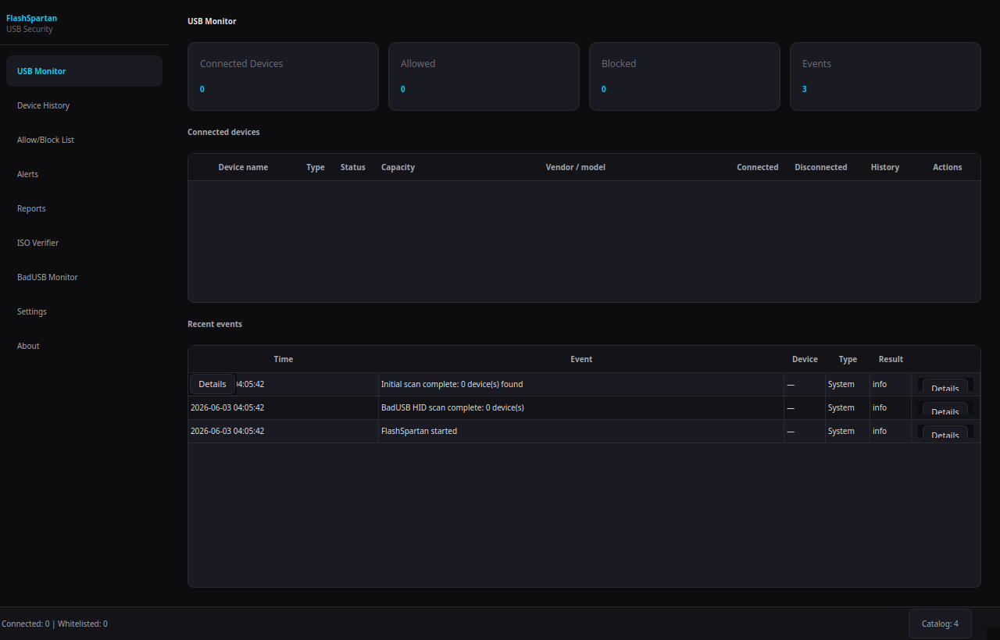
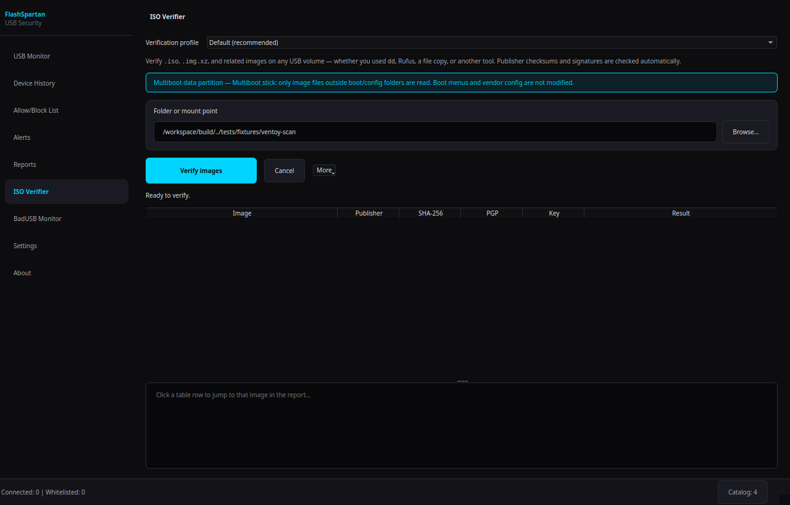
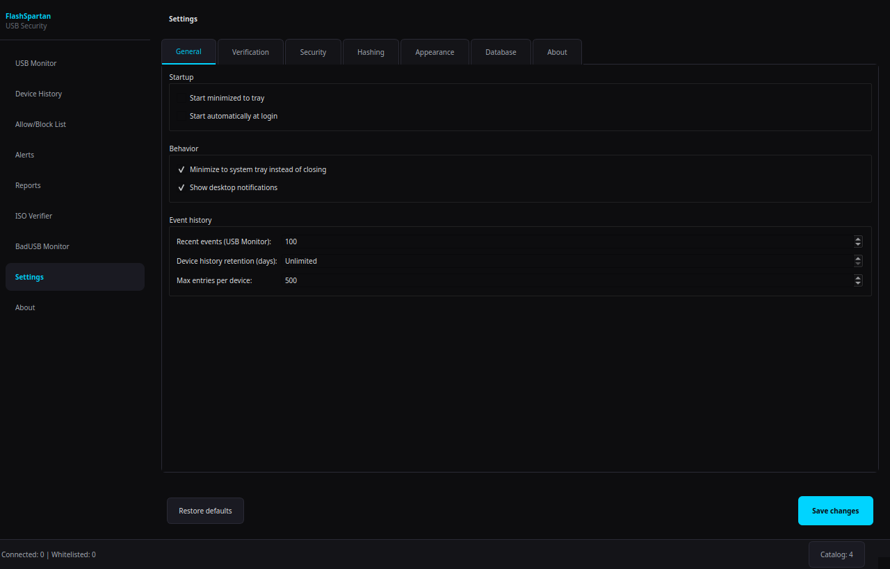
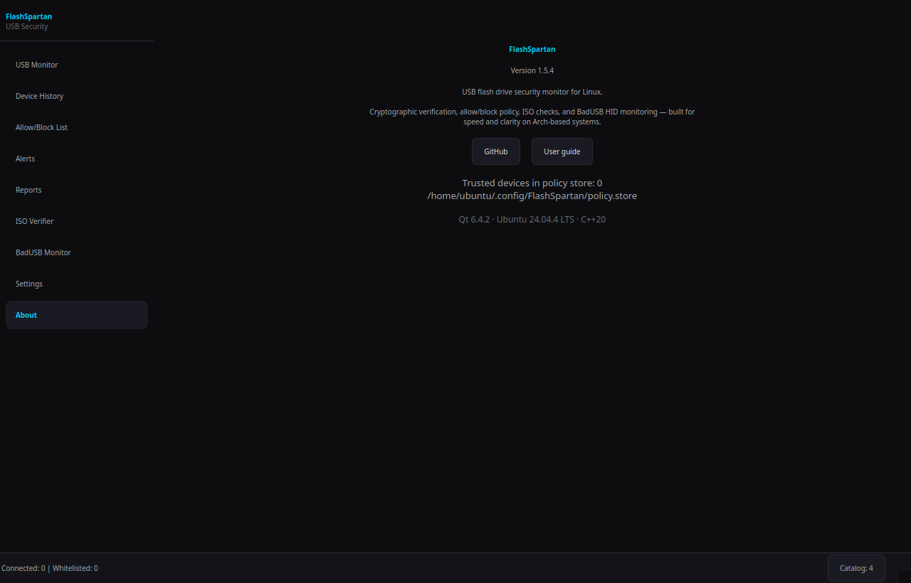

# FlashSpartan

<p align="center">
  
</p>

<p align="center">
  <strong>USB storage security monitor for Linux and Windows</strong>
</p>

<p align="center">
  <a href="#screenshots">Screenshots</a> •
  <a href="#features">Features</a> •
  <a href="#installation">Installation</a> •
  <a href="#windows">Windows</a> •
  <a href="#usage">Usage</a> •
  <a href="#documentation">Docs</a>
</p>

FlashSpartan watches USB storage, keeps a signed trust store of known devices, verifies Linux ISOs on removable media, and alerts you when fingerprints or watched folders change. It is built with **Qt 6** and **OpenSSL**.

| Platform | Status | Highlights |
|----------|--------|------------|
| **Linux (Arch primary)** | Full | libudev hotplug, UDisks2 + polkit mounts, optional `flashspartan-policyd`, raw-disk hashing |
| **Windows 10/11** | Supported | Volume + USB host detection, ISO verify, BadUSB HID, optional USBPcap, UAC raw read helper |

**Current version:** 1.5.4 — see [CHANGELOG.md](CHANGELOG.md)

Repository: [github.com/RNAX0N/flashsentry](https://github.com/RNAX0N/flashsentry) (product name **FlashSpartan**; legacy tags used **FlashSentry**)

---

## Screenshots

Captured from the shipping UI (Cyber Dark). Regenerate after UI changes:

```bash
cmake --build build --target flashspartan
xvfb-run -a ./build/flashspartan --capture-screenshots=docs/images --no-tray --force
```

| USB Monitor | ISO Verifier |
|:---:|:---:|
|  |  |

| Settings | About |
|:---:|:---:|
|  |  |

More: [Allow/Block list](docs/images/allow-block-list.png) · [Reports](docs/images/reports.png) · [BadUSB Monitor](docs/images/badusb-monitor.png)

---

## Features

### For most users

- **Automatic ISO verification** — finds `.iso` files on mounted USB volumes, checks publisher checksums and OpenPGP where configured
- **Watch-folder verification** — Merkle baseline on paths you choose; alerts when watched files change without hashing every sector
- **USB Monitor** — removable storage, recent events, allow/block stats; built-in USB host nodes tracked separately on Windows (not counted as “drives”)
- **Left navigation** — USB Monitor, device history, allow/block, alerts, reports, ISO Verifier, BadUSB, settings, about

### USB & trust

- Real-time detection (libudev on Linux; volumes + SetupAPI on Windows)
- Signed policy store (`policy.store`) with allow/block list and audit log
- Trust levels, prompts for new or modified devices, optional block-on-mismatch
- Secure mount defaults on Linux (`noexec`, `nosuid`, `nodev`) via UDisks2
- System tray and desktop notifications (Linux: `libnotify`)
- Partition vs whole-disk hashing, quick sample mode, cancel/ETA, resume checkpoints
- Five themes: Cyber Dark, Neon Purple, Matrix Green, Blade Runner, Ghost White

### Security & reporting

- **Alerts** — session security events and failed verifications
- **Reports** — verification history, `audit.log`, `policy-audit.log`
- **BadUSB** — HID baseline and anomaly detection; optional usbmon (Linux) or USBPcap (Windows, separate install)

### Advanced

- Full partition hash (SHA-256 / SHA-512 / BLAKE2b) over block devices
- Hybrid profile: watch folders first, optional full-disk hash
- CLI: `flashspartan --verify-iso`, `--verify-mount`, `--verify-dir`, `--export-report`

---

## Installation

### Linux — Arch (AUR)

```bash
yay -S flashspartan
# or: paru -S flashspartan
```

### Linux — from source

```bash
git clone https://github.com/RNAX0N/flashsentry.git
cd flashsentry/packaging
./build-package.sh -si
```

Installs `flashspartan`, `flashspartan-policyd`, and `flashspartan-read-helper`.

### Linux — post-install

```bash
# Raw partition hashing
sudo usermod -aG storage "$USER"

# Optional autostart (user service)
systemctl --user enable --now flashspartan.service

# Recommended: disable DE automount so FlashSpartan controls mounts (example: GNOME)
gsettings set org.gnome.desktop.media-handling automount false
```

Log out and back in after adding the `storage` group.

---

## Windows

Windows builds use the same navigation shell, policy store, ISO verifier, alerts/reports, and watch-folder checks on drive letters (`E:\`, etc.).

| Capability | Windows |
|------------|---------|
| USB flash / ISO-stick volumes | Yes (including fixed-disk USB reported by Windows) |
| ISO verification & catalog | Yes |
| BadUSB HID monitoring | Yes |
| Safe eject / open folder | Yes |
| Full-disk raw hash (`\\.\PhysicalDriveN`) | Yes (UAC helper) |
| Optional USBPcap capture | Yes ([download](https://desowin.org/usbpcap/) or in-app **Download USBPcap**) |
| `flashspartan-policyd` | Built; in-process fallback available |
| Programmatic mount (new letter) | No — Explorer assigns letters; app discovers mounts |
| libudev / UDisks2 | N/A |

### Download

Installers are on **[GitHub Releases](https://github.com/RNAX0N/flashsentry/releases/latest)**:

| Asset | Use |
|-------|-----|
| `FlashSpartan-*-x64-setup.exe` | Recommended graphical installer |
| `FlashSpartan-*-x64.msi` | MSI / enterprise |
| `FlashSpartan-*-x64-portable.zip` | Portable, no installer |

Upgrading from FlashSentry? [docs/MIGRATION-FROM-FLASHSENTRY.md](docs/MIGRATION-FROM-FLASHSENTRY.md)

Details: [docs/WINDOWS.md](docs/WINDOWS.md) · [packaging/windows/INSTALLER.md](packaging/windows/INSTALLER.md)

### Build (Windows)

```powershell
cmake -B build -G "Visual Studio 17 2022" -A x64 `
  -DCMAKE_BUILD_TYPE=Release `
  -DFLASHSPARTAN_BUILD_TESTS=ON `
  -DOPENSSL_ROOT_DIR="C:\Program Files\OpenSSL-Win64"
cmake --build build --config Release
ctest --test-dir build -C Release --output-on-failure
```

---

## Usage

```bash
flashspartan                  # normal start
flashspartan --minimized      # tray only
flashspartan --debug          # verbose log (see docs/DIAGNOSTICS.md)
flashspartan --settings       # open settings on launch
flashspartan --help
```

**Typical flow:** connect drive → trust or block → verify (hash / manifest / ISO) → mount or open → eject (optional re-hash).

| Shortcut | Action |
|----------|--------|
| `Ctrl+R` | Refresh devices |
| `Ctrl+,` | Settings |
| `Ctrl+Q` | Quit |
| `Escape` | Minimize to tray (if enabled) |

Linux policy daemon starts automatically when installed; override for development:

```bash
export FLASHSPARTAN_POLICY_IN_PROCESS=1
flashspartan
```

---

## Configuration

**Settings file:** `~/.config/FlashSpartan/FlashSpartan.conf` (Windows: `%AppData%\FlashSpartan\FlashSpartan.conf`)

| Key area | Examples |
|----------|----------|
| Security | Auto-hash on connect/eject, block modified, confirm new devices |
| Hashing | SHA256 / SHA512 / BLAKE2b, buffer size, mmap, scope & scan mode |
| ISO | Auto-verify on scan/mount, parallel jobs, offline sidecars |
| Diagnostics | Host USB inventory log, external peripherals in USB table — see [docs/DIAGNOSTICS.md](docs/DIAGNOSTICS.md) |

### Data files

| Path | Purpose |
|------|---------|
| `policy.store` / `policy.key` | Signed trust & block list |
| `policy-audit.log` | Policy mutations |
| `verify-history.json` | Verification history |
| `audit.log` | ISO / BadUSB audit (JSON lines) |
| `cache/logs/flashspartan.log` | Qt application log |
| `cache/logs/host-usb-inventory.jsonl` | Windows USB host inventory (support) |

---

## Building & tests

### Linux

```bash
sudo pacman -S qt6-base qt6-tools cmake base-devel openssl pkgconf
cmake -B build -DCMAKE_BUILD_TYPE=Release -DFLASHSPARTAN_BUILD_TESTS=ON
cmake --build build -j"$(nproc)"
ctest --test-dir build --output-on-failure
sudo cmake --install build --prefix /usr
```

### Documentation screenshots

```bash
./build/flashspartan --capture-screenshots=docs/images --no-tray --force
```

Requires a display or `xvfb-run` on headless CI.

---

## Troubleshooting

| Issue | Linux | Windows |
|-------|-------|---------|
| Device not detected | `udevadm monitor --subsystem-match=block` | Check Explorer assigns a drive letter; see [DIAGNOSTICS.md](docs/DIAGNOSTICS.md) |
| Hash permission denied | `groups` → add `storage`, re-login | Approve UAC for read helper |
| Mount fails | `systemctl status udisks2`, polkit agent | Use Explorer; app uses existing mount |
| Policy errors | `flashspartan-policyd`, `policy-audit.log` | `FLASHSPARTAN_POLICY_IN_PROCESS=1` |

---

## Documentation

| Document | Description |
|----------|-------------|
| [docs/USER_GUIDE.md](docs/USER_GUIDE.md) | Day-to-day workflows |
| [docs/VERIFICATION.md](docs/VERIFICATION.md) | Verification internals |
| [docs/WINDOWS.md](docs/WINDOWS.md) | Windows build & limits |
| [docs/DIAGNOSTICS.md](docs/DIAGNOSTICS.md) | Logs, USB inventory, crash reports |
| [docs/SCREENSHOTS.md](docs/SCREENSHOTS.md) | Capture screenshots for docs |
| [CHANGELOG.md](CHANGELOG.md) | Release notes |
| [CLAUDE.md](CLAUDE.md) | Architecture (developers) |

---

## Security

- No continuous root — polkit (Linux) or UAC helper (Windows) for privileged operations
- HMAC-protected policy store with append-only audit
- Optional separate `flashspartan-policyd` process
- Cryptographic hashes and Merkle manifests for tamper detection
- User-configurable prompts and block rules

---

## Contributing

See [CONTRIBUTING.md](CONTRIBUTING.md). Issues: [GitHub Issues](https://github.com/RNAX0N/flashsentry/issues).

## License

MIT — see [LICENSE](LICENSE).
