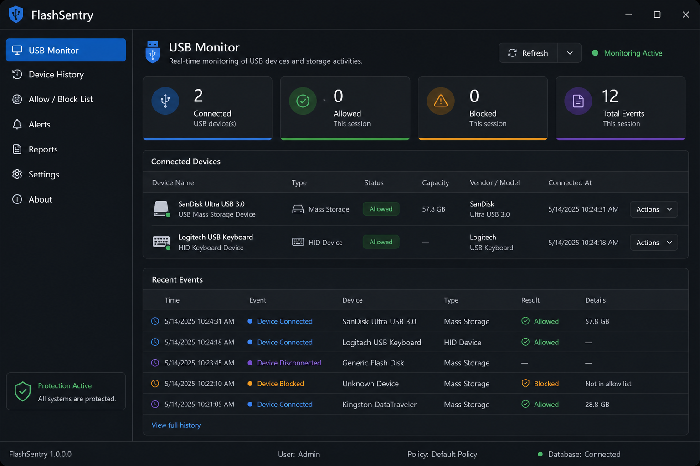

# FlashSentry

<p align="center">
  
</p>

<p align="center">
  <strong>USB flash drive security monitor for Linux and Windows</strong>
</p>

<p align="center">
  <a href="#features">Features</a> •
  <a href="#application-ui">UI</a> •
  <a href="#installation">Installation</a> •
  <a href="#windows">Windows</a> •
  <a href="#usage">Usage</a> •
  <a href="#configuration">Configuration</a> •
  <a href="#building">Building</a>
</p>

---

FlashSentry monitors USB storage, maintains a cryptographic whitelist of trusted devices, verifies Linux ISOs on mounted sticks, and alerts you when content changes. It is built with Qt6 and OpenSSL.

- **Linux (Arch, primary):** libudev device events, UDisks2 mounts, polkit, optional `flashsentry-policyd` and raw-disk hashing.
- **Windows 10/11 (preview):** removable-volume polling via Qt, full GUI shell, ISO verify, watch manifests, signed policy store (in-process). See [docs/WINDOWS.md](docs/WINDOWS.md).

**Current version:** 1.4.2 (see [CHANGELOG.md](CHANGELOG.md))

## Features

### Recommended for most users

| Feature | What it does |
|--------|----------------|
| **Automatic ISO verification** | Finds `.iso` files on mounted USB volumes, downloads official checksums/signatures, verifies hashes and OpenPGP where configured |
| **Watch-folder verification** | You choose paths on a drive; FlashSentry builds a Merkle baseline and alerts when watched files change — without reading every sector |
| **Left-nav shell** | Dedicated pages for USB monitoring, device history, allow/block lists, alerts, reports, ISO verify, BadUSB, settings, and about |

### USB monitoring

- **Real-time detection** — libudev (no polling)
- **Whitelist & trust levels** — remember devices; prompt on unknown or modified content
- **Allow / block list** — block drives by key or device ID; list persists in the signed policy store
- **Secure mounting** — UDisks2 + polkit; default options include `noexec`, `nosuid`, `nodev`
- **System tray** — background operation with optional desktop notifications (`libnotify`)
- **Smarter hashing** — partition vs whole-disk target, quick sample vs full read, cancel + ETA, resume checkpoints
- **Themes** — Cyber Dark, Neon Purple, Matrix Green, Blade Runner, Ghost White

### Security & reporting

| Feature | What it does |
|--------|----------------|
| **Alerts page** | Security-relevant session events (warnings, mismatches, blocks) plus failed verifications from history |
| **Reports page** | Verification history table, verification audit log (`audit.log`), policy mutation log (`policy-audit.log`) |
| **Policy daemon** | `flashsentry-policyd` owns the signed trust/block store; the GUI talks to it over a local socket (in-process fallback if the daemon is unavailable) |
| **BadUSB monitor** | HID baseline and anomaly detection (optional usbmon capture) |

### Advanced (optional)

| Feature | What it does |
|--------|----------------|
| **Full partition hash** | Raw SHA-256 / SHA-512 / BLAKE2b over the block device — slow, byte-level tamper detection |
| **Hybrid profile** | Watch folders first, then optional full partition hash |

## Application UI

The main window uses a **left navigation rail** and a **page stack**:

| Page | Purpose |
|------|---------|
| **USB Monitor** | Connected devices, stats, recent events |
| **Device History** | Per-device timeline (events + verification history) |
| **Allow/Block List** | Manage trusted and blocked drives |
| **Alerts** | Filtered security warnings and verification failures |
| **Reports** | Verification history and audit log tails |
| **ISO Verifier** | Manual and automatic ISO checks |
| **BadUSB Monitor** | HID baselines and anomalies |
| **Settings** | Full settings UI (live apply for many options) |
| **About** | Version, policy store path, links |

Legacy header tabs may still switch between USB-focused and ISO-focused layouts depending on settings; see [docs/USER_GUIDE.md](docs/USER_GUIDE.md).

## Who is this for?

- Anyone who puts Linux or Windows images on USB (`dd`, Rufus, copy, multiboot sticks) and wants a clear pass/fail report
- Users who care about specific folders on a stick without hashing every sector
- Power users who want full-disk fingerprints, custom hash algorithms, or BadUSB HID monitoring

If you only need “is every byte on this partition the same as last time?”, enable full-partition hashing in **Settings → Security**.

## Screenshots

| CyberDark Theme | Device Detection |
|:---:|:---:|
|  |

More UI reference images: [`docs/images/`](docs/images/). Capture guidance: [docs/SCREENSHOTS.md](docs/SCREENSHOTS.md).

After install, user docs are under `/usr/share/doc/flashsentry/` (including [docs/USER_GUIDE.md](docs/USER_GUIDE.md)).

## Installation

### From AUR (recommended)

```bash
yay -S flashsentry
# or
paru -S flashsentry
```

### From source (Arch)

```bash
git clone https://github.com/RNAX0N/flashsentry.git
cd flashsentry/packaging
./build-package.sh -si
```

This builds and installs `flashsentry`, `flashsentry-policyd`, and `flashsentry-read-helper` via CMake.

### Post-installation setup

```bash
# Raw partition hashing (recommended)
sudo usermod -aG storage $USER

# Optional: autostart minimized to tray
systemctl --user enable --now flashsentry.service

# Recommended: disable the desktop environment's automount so FlashSentry controls mounts
# GNOME:
gsettings set org.gnome.desktop.media-handling automount false
# KDE: System Settings → Removable Storage → disable automount
```

Log out and back in after adding yourself to the `storage` group.

## Windows

Windows builds are supported at the **preview** level: the app runs with the same navigation shell, policy store, ISO verifier, alerts/reports, and watch-folder verification on mounted drive letters (`E:\`, etc.).

Not yet on Windows (stubs return clear errors):

- Programmatic mount/eject (Explorer handles removable volumes)
- Full-partition raw hashing (`\\.\PhysicalDriveN`)
- BadUSB HID monitoring and usbmon capture
- `flashsentry-policyd` / `flashsentry-read-helper` (policy runs in-process)

**Build:** Qt 6, MSVC, OpenSSL — full steps in [docs/WINDOWS.md](docs/WINDOWS.md). CI produces a portable ZIP artifact on each push.

```powershell
cmake -B build -G "Visual Studio 17 2022" -A x64 `
  -DCMAKE_BUILD_TYPE=Release `
  -DFLASHSENTRY_BUILD_TESTS=ON `
  -DOPENSSL_ROOT_DIR="C:\Program Files\OpenSSL-Win64"
cmake --build build --config Release
ctest --test-dir build -C Release --output-on-failure
```

## Usage

### Starting FlashSentry

```bash
flashsentry                  # normal start
flashsentry --minimized      # start in the system tray
flashsentry --debug          # verbose Qt logging
flashsentry --no-tray        # disable tray icon
flashsentry --help           # all options
```

On Linux, the policy daemon is started automatically when needed (`flashsentry-policyd`). On Windows, policy always runs in-process.

For tests or development without the daemon (Linux):

```bash
export FLASHSENTRY_POLICY_IN_PROCESS=1
flashsentry
```

### Typical USB workflow

1. **Connect a USB device** — FlashSentry detects it (udev on Linux, volume polling on Windows).
2. **New device?** — You are prompted to trust it (whitelist / watch folders / hash).
3. **Known device?** — Verification runs according to its profile (watch manifest, hash, or both).
4. **Hash or manifest matches** — Mount proceeds (subject to your settings).
5. **Mismatch** — Security alert; mounting can be blocked if configured.
6. **Eject** — Optional re-hash before removal.

### Keyboard shortcuts

| Shortcut | Action |
|----------|--------|
| `Ctrl+R` | Refresh device list |
| `Ctrl+,` | Open settings |
| `Ctrl+Q` | Quit |
| `Escape` | Minimize to tray (when tray is enabled) |

## Configuration

### Application settings

Primary settings file:

`~/.config/FlashSentry/FlashSentry.conf`

| Setting | Default | Description |
|---------|---------|-------------|
| Auto-hash on connect | off (preset-dependent) | Verify on plug-in |
| Auto-hash on eject | varies | Re-hash before eject |
| Block modified devices | off | Refuse mount on mismatch |
| Hash algorithm | SHA256 | SHA256, SHA512, or BLAKE2b |
| Buffer size | 1024 KB | Read buffer (64–16384 KB) |
| Use memory mapping | on | mmap for faster hashing |
| Allowed-count mode | configurable | What counts as “allowed” in stats (trust / hash / either) |

System-wide defaults (optional): `/etc/flashsentry/config.json` — see packaging `config.json.default`.

### Data and audit files

| Path | Purpose |
|------|---------|
| `~/.config/FlashSentry/policy.store` | Signed trust list and block list (authoritative) |
| `~/.config/FlashSentry/policy.key` | HMAC key for `policy.store` (mode 600) |
| `~/.config/FlashSentry/policy-audit.log` | Append-only policy mutations |
| `~/.config/FlashSentry/verify-history.json` | Verification history (hash / manifest / ISO) |
| `~/.config/FlashSentry/audit.log` | ISO and BadUSB audit events (JSON lines) |
| `~/.config/FlashSentry/hash-checkpoints.json` | Resume data for long full-disk hashes |
| `~/.config/FlashSentry/blocked-drives.json.migrated` | Legacy block list (after migration only) |
| `~/.config/FlashSentry/flashsentry/devices.json.migrated` | Legacy device JSON (after migration only) |

JSON export/import in **Settings** is for backup and interchange only; the policy store is the source of truth.

### Themes

- **Cyber Dark** (default) — cyan on dark
- **Neon Purple** — magenta / purple
- **Matrix Green** — green terminal aesthetic
- **Blade Runner** — warm amber
- **Ghost White** — light theme

## Building from source

### Linux (Arch)

```bash
sudo pacman -S qt6-base qt6-tools cmake base-devel openssl pkgconf
mkdir build && cd build
cmake -DCMAKE_BUILD_TYPE=Debug -DFLASHSENTRY_BUILD_TESTS=ON ..
cmake --build . -j"$(nproc)"
./flashsentry
```

### Windows

See [docs/WINDOWS.md](docs/WINDOWS.md). Output executable: `FlashSentry.exe`.

### Tests

```bash
ctest --test-dir build --output-on-failure
```

### Release install

```bash
cmake -DCMAKE_BUILD_TYPE=Release ..
cmake --build . -j"$(nproc)"
sudo cmake --install . --prefix /usr
```

Installed binaries include `flashsentry`, `flashsentry-policyd`, and `flashsentry-read-helper` (privileged raw read helper).

## Kernel compatibility

Works with standard Arch kernels that provide udev and USB mass storage:

- `linux`, `linux-lts`, `linux-zen`, `linux-hardened`
- Custom kernels with normal block-device support

## Troubleshooting

### Device not detected

```bash
udevadm monitor --property --udev --subsystem-match=block
udevadm control --reload-rules && udevadm trigger
```

### Permission denied when hashing

```bash
groups | grep storage
sudo usermod -aG storage "$USER"
# log out and back in
```

### Mount operations fail

```bash
systemctl status udisks2.service
pgrep -f polkit
```

### Policy / trust store errors

```bash
# Check daemon socket and logs
ls -la "${XDG_RUNTIME_DIR:-/tmp}/flashsentry-policy.sock"
tail -20 ~/.config/FlashSentry/policy-audit.log
```

### Hash speed is slow

1. Enable memory mapping in settings.
2. Increase buffer size (e.g. 4096 KB).
3. Prefer watch-folder verification over full-disk hash when possible.
4. Use a USB 3 port.

## Security

- **No continuous root** — polkit escalates mount and helper operations.
- **Signed policy store** — HMAC-protected `policy.store`; mutations logged.
- **Split process** — `flashsentry-policyd` can hold policy state separately from the GUI.
- **Secure mount defaults** — `noexec`, `nosuid`, `nodev` where supported.
- **Tamper detection** — Cryptographic hashes and Merkle manifests on watched paths.
- **User confirmation** — Prompts for unknown or modified devices (configurable).

**Practices:** enable “block modified devices” in sensitive environments; review the allow/block list; keep verification audit logs; use SHA-512 or BLAKE2b if you need stronger hashes.

## Documentation

| Document | Description |
|----------|-------------|
| [docs/USER_GUIDE.md](docs/USER_GUIDE.md) | Day-to-day workflows |
| [docs/VERIFICATION.md](docs/VERIFICATION.md) | Verification internals |
| [docs/WINDOWS.md](docs/WINDOWS.md) | Windows build, limits, packaging |
| [CHANGELOG.md](CHANGELOG.md) | Release notes |
| [CLAUDE.md](CLAUDE.md) | Developer / architecture notes |

## Contributing

See [CONTRIBUTING.md](CONTRIBUTING.md). Bug reports and feature requests: [GitHub Issues](https://github.com/RNAX0N/flashsentry/issues).

## License

MIT License — see [LICENSE](LICENSE).

## Acknowledgments

- Qt Project, OpenSSL, freedesktop.org (UDisks2, polkit)
- Arch Linux community

---

<p align="center">
  Made for the Arch Linux community
</p>
