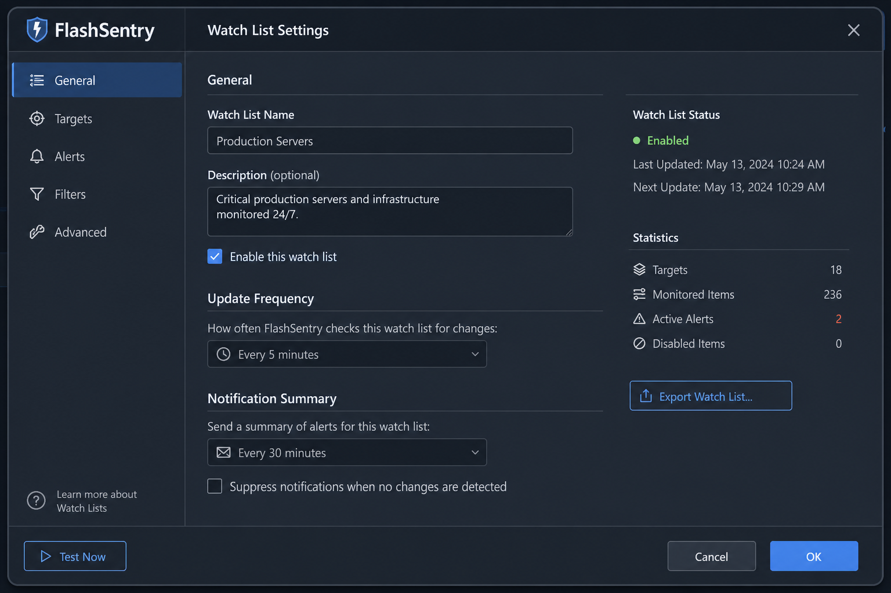

# FlashSpartan User Guide

This guide explains how to use FlashSpartan day to day. You do **not** need prior knowledge of SHA-256, PGP, or Kleopatra for the main workflows.

## What FlashSpartan does

FlashSpartan offers three levels of checking, from most practical to most thorough:

| Level | Best for | Speed |
|-------|----------|-------|
| **ISO verification** | Linux install images on a USB stick | Minutes (hashes one large file + downloads metadata) |
| **Watch folders** | Documents, boot files, or project trees on a stick | Seconds to minutes (only selected paths) |
| **Full partition hash** | “Every byte on this partition must match” | Slow (reads entire device) |

**Defaults are chosen for real users:** ISO auto-check on mount is **on**; full-partition hash on connect is **off**; new devices use **watch folders** when you set up verification.

---

## Application modes

Open **Settings → Verification → Mode**.

### USB drive monitor (default)

- Shows connected USB partitions as cards
- Runs the verification **profile** you chose per device (watch / full / hybrid)
- ISO auto-verify still runs on mount if enabled

### Automatic ISO verification

- Main window becomes the **ISO Verify** screen
- Table + detailed text report per image
- Use **Verify now** for a folder, or plug in a USB stick (with auto-verify enabled)

---

## Workflow 1: Verify a Linux ISO (recommended)

### What you need

- Arch Linux with FlashSpartan installed
- `gpg` package (`sudo pacman -S gnupg`)
- Internet access when verifying (to download official checksums)
- A USB stick with an image file on it — after **Rufus**, **`dd`**, a manual copy, or any similar method

### Steps

1. Enable **Settings → Verification → Automatically verify ISOs when a USB drive is mounted** (default: on).
2. Insert the USB drive and wait for it to mount.
3. FlashSpartan will:
   - Find `.iso` files on the volume
   - Match the filename to a known publisher (see [supported list](#supported-iso-publishers-automatic))
   - Download official `SHA256SUMS` (or equivalent) and signature files
   - Compute SHA-256 of your on-drive copy
   - Run `gpg --verify` in an isolated cache directory
   - Compare the signing key fingerprint to built-in trusted values
4. Read the result:
   - **Activity log** (USB mode), or
   - **ISO Verify** table and report (ISO mode / **Full report** button)

### What “PASS” means

- Your file’s hash matches the publisher’s published hash, **and**
- The checksum file’s signature is valid, **and**
- The signing key fingerprint matches FlashSpartan’s trusted list for that distro

### What if verification fails?

| Message | Likely cause |
|---------|----------------|
| Hash mismatch | Corrupt download, wrong file, or incomplete copy |
| PGP failed | Missing `gpg`, bad signature file, or tampered checksums |
| Untrusted fingerprint | Key not in FlashSpartan’s list (report upstream) |
| Unknown publisher | Unsupported filename; add `.sha256` / `.asc` sidecars manually |
| No ISO found | Stick was written with `dd` as a live image — see below |

### Offline / sidecar files

If you already downloaded checksums, you can place them next to the ISO on the stick:

- `myimage.iso.sha256` or `SHA256SUMS`
- `myimage.iso.asc` or `SHA256SUMS.gpg`

FlashSpartan uses these when publisher download is unavailable.

### `dd` or Rufus “ISO mode” without a loose file

When the stick **is** the live system (no separate `.iso` on the filesystem), FlashSpartan detects a **bootable layout** and explains that:

- Automated ISO file hashing needs a `.iso` on the volume, **or**
- Use **watch folders** for important paths, **or**
- Enable **full partition hash** for byte-level comparison

---

## Workflow 2: Watch specific folders (file-tree verification)

Use this when you care about **certain files** changing, not the entire drive.

### Setup (first time)

1. Connect the USB device and mount it.
2. Click **Watch lists** on the device card.
3. Create a **group** (e.g. “Work files”) and add paths:
   - Single file: `report.pdf`
   - Folder: `Documents` (hashes all files inside recursively)
4. Choose verification profile for this device if prompted.
5. Click **Build baseline** — FlashSpartan stores a Merkle root for each group.

### Everyday use

1. Plug in the device (auto-mount).
2. FlashSpartan compares current files to the baseline.
3. **Match** → status shows verified.
4. **Mismatch** → you can rebuild baseline (intentional change) or investigate tampering.

### Tips

- Keep groups small and meaningful (faster, clearer alerts).
- Rebuild baseline after **you** intentionally update files.
- Use **Hybrid** profile only if you also want a full partition hash afterward.

---

## Workflow 3: Full partition hash (advanced)

Use when you need a fingerprint of **every byte** on the partition.

1. **Settings → Security → Full-drive hashing**
2. Enable **Hash entire partition when a device is connected**
3. Ensure your user is in the `storage` group
4. First connect stores the hash; later connects compare

**Warning:** Large drives take a long time. Prefer ISO or watch-folder modes unless you have a specific reason.

---


## Smarter hashing (1.5+)

FlashSpartan can fingerprint **one partition** or the **entire block device** when several partitions share the same USB drive.

| Scan mode | Speed | Use when |
|-----------|-------|----------|
| **Full partition read** | Slowest | You need a byte-for-byte baseline |
| **Quick sample** | Fast | Spot-check: first/last MiB plus spaced samples (stored as `SHA256-QUICK`) |
| **Watch folders only** | Fastest | You already built a Merkle watch-list baseline |

During a long full scan:

- Click **Cancel** on the device card to stop; progress is saved in `hash-checkpoints.json` when resume is enabled in Settings.
- The card shows **percent**, **GiB done/total**, **MB/s**, and **ETA**.

Configure defaults under **Settings → Hashing → Smarter hashing**. Click **Rehash / Verify** to pick scope and mode per run.

---

## Verify history (sidebar)

The main window sidebar lists recent verification results (full-disk hash, watch-folder manifest, and ISO/image scans). Entries are stored in `~/.config/FlashSpartan/verify-history.json` (up to 500 events).

- **Filter by device** — click a device card to show only that drive’s history.
- **Open ISO report** — click a history line (or a mounted device card) to jump to the **ISO verify** tab with that volume selected.
- **Clear filter** — click the device card again or connect another device.

---

## First-run wizard

On first launch (or when **Show this wizard again on next start** is enabled), FlashSpartan walks through:

1. **Intro** — ISO verify, watch folders, and optional full-partition hash.
2. **Security preset** — choose **Default**, **Multi-image USB**, **Work USB**, or **Paranoid** (see below).
3. **System setup** — checks membership in the `storage` group and shows commands to disable desktop auto-mount (GNOME `gsettings` example).

To run the wizard again, enable **Show this wizard again on next start** on the last wizard page (or set `general/showFirstRunWizard` to `true` in `~/.config/FlashSpartan/FlashSpartan.conf`), then restart FlashSpartan.

---

## Security presets

| Preset | Best for |
|--------|----------|
| **Default** | ISO verify on USB mount, watch-folder verification, balanced prompts |
| **Multi-image USB** | Sticks with copied ISOs, `dd`, Rufus, or multiboot layouts — auto image verify, no full-disk hash on connect |
| **Work USB** | Project drives with watch-folder baselines; ISO auto-verify on mount off |
| **Paranoid** | Maximum caution: hash on connect and eject, ISO verify on mount and scan, block mount on failure, confirm tampering, single parallel verify job |

Preset descriptions also appear under **Settings → General → Security preset**.

---

## Device card actions

| Button | Action |
|--------|--------|
| Mount / Unmount / Eject | Standard volume control |
| Rehash | Force verification for this device |
| Watch lists | Edit groups and baselines |
| Open folder | Open mount point in file manager |

---

## Settings reference

### General tab

| Option | Description |
|--------|-------------|
| **Start minimized to tray** | Launch into the tray instead of showing the main window |
| **Start automatically at login** | Enables `flashspartan.service` (systemd user unit) when installed from the Arch package; otherwise writes an XDG autostart entry under `~/.config/autostart/` |
| **Minimize to tray instead of closing** | Keep running in the background when the window is closed |
| **Show desktop notifications** | Tray / libnotify alerts for device events |

### Verification tab

| Option | Description |
|--------|-------------|
| **Mode** | USB monitor vs ISO-focused UI |
| **Default USB profile** | Watch folders / full partition / hybrid |
| **Scan folder** | Default directory for manual ISO scan |
| **Verify after scan** | Auto-run when scanning a folder in ISO mode |
| **Verify on USB mount** | Auto ISO check when removable media mounts |

### Security tab

| Option | Description |
|--------|-------------|
| **Hash entire partition when connected** | Full raw hash (off by default) |
| **Re-hash before eject** | Optional final check |
| **Ask before mounting new devices** | Whitelist prompt |
| **Alert when hash doesn’t match** | Tamper / manifest dialogs |
| **Block modified devices** | Do not mount after failure |

### Hashing tab

Algorithm, buffer size, memory mapping — mainly for **full partition** mode.

---

## Supported ISO publishers (automatic)

Filename patterns (examples):

| Publisher | Example filename |
|-----------|------------------|
| Arch Linux | `archlinux-2024.11.01-x86_64.iso` |
| Ubuntu | `ubuntu-24.04.2-desktop-amd64.iso` |
| Kubuntu / Xubuntu / Lubuntu | `kubuntu-24.04-desktop-amd64.iso` |
| Ubuntu MATE / Ubuntu Studio | `ubuntu-mate-24.04-desktop-amd64.iso` |
| Debian | `debian-12.8.0-amd64-netinst.iso` |
| Fedora | `Fedora-Workstation-Live-41-1.4.x86_64.iso` |
| Linux Mint | `linuxmint-22.2-cinnamon-64bit.iso` |
| openSUSE Leap | `openSUSE-Leap-15.6-DVD-x86_64-Media.iso` |
| openSUSE Tumbleweed | `openSUSE-Tumbleweed-DVD-x86_64-Current.iso` |
| Manjaro | `manjaro-kde-25.0.0-250527-linux612.iso` |
| Kali Linux | `kali-linux-2024.4-live-amd64.iso` |
| CentOS Stream | `CentOS-Stream-9-x86_64-dvd1.iso` |
| Rocky Linux / AlmaLinux | `Rocky-9.4-x86_64-minimal.iso` |
| elementary OS | `elementaryos-7.1-amd64.iso` |
| Pop!_OS | `pop-os_22.04_amd64_intel_35.iso` |
| EndeavourOS | `endeavouros-2024.12.18-x86_64.iso` |
| Garuda Linux | `garuda-hyprland-linux-zen-250308.iso` |
| CachyOS | `cachyos-desktop-linux-260308.iso` |
| Nobara Linux | `Nobara-43-Official-2026-04-19.iso` |
| Raspberry Pi OS | `2024-11-19-raspios-bookworm-arm64.img.xz` |
| Ubuntu for Raspberry Pi | `ubuntu-24.04.3-preinstalled-server-arm64+raspi.img.xz` |
| Armbian | `Armbian_25.2.1_Odroidn2_bookworm_current.img.xz` + `.img.xz.sha` sidecar |
| Alpine / Void / NixOS | `alpine-standard-3.20.3-x86_64.iso`, `void-live-x86_64-*.iso`, `nixos-*-x86_64-linux.iso` |
| Microsoft Windows | `Win11_24H2_English_x64.iso` (manifest + optional `.sha256` sidecar) |

Publisher mirrors and keys are defined in the application; see [VERIFICATION.md](VERIFICATION.md) for technical detail.

---

## Screenshots

| USB monitor | ISO verification |
|-------------|------------------|
|  |  |

Watch folder setup: 

## Command-line verification (1.2.0+)

Headless checks exit with `0` on full pass, `1` if any image fails, `2` on usage errors:

```bash
flashspartan --verify-iso /path/to/debian-12.5.0-amd64-netinst.iso
flashspartan --verify-mount /run/media/$USER/USB
flashspartan --verify-dir ~/Downloads/isos
flashspartan --update-catalog
flashspartan --export-report /run/media/$USER/USB --report-format csv
flashspartan --list-publishers
flashspartan --trust-hash Win11_24H2_English_x64.iso:41196290521b7e4f814aca30c2cc4c7fab1e3076439418673b90954a1ffc54
```

Reports can be plain text (default), `csv`, `html`, or `json`. Profiles: **Default**, **Multi-image USB**, **Work USB**, **Paranoid** (settings id `multi_image` replaces the legacy `ventoy` id automatically).

---

## Files and privacy

| Path | Contents |
|------|----------|
| `~/.config/FlashSpartan/FlashSpartan.conf` | UI and behavior settings |
| `~/.config/flashspartan/devices.json` | Whitelist, baselines, optional partition hashes |
| `~/.config/flashspartan/audit.log` | JSON-lines log of ISO verify results |
| `~/.config/flashspartan/iso-catalog.d/` | Optional drop-in manifest fragments |
| `~/.cache/FlashSpartan/iso-verify/` | Downloaded checksums, GPG homedir cache |

ISO verification contacts publisher mirrors over HTTPS. No telemetry is sent to FlashSpartan developers by the app itself.

---

## FAQ

**Do I need Kleopatra?**  
No. FlashSpartan calls `gpg` itself with a private homedir under your cache directory.

**Will it verify Windows ISOs?**  
Known builds are listed in the embedded catalog (refresh with **Update catalog** or `--update-catalog`). For other `Win11_*` / `Win10_*` names, place a `.sha256` sidecar from Microsoft’s download page next to the ISO.

**Can I use it only for ISOs and ignore USB whitelisting?**  
Yes. Set **Mode** to **Automatic ISO verification** and use folder scan or mount auto-verify.

**Why is full-disk hashing off by default?**  
It is slow and confusing for most people. Watch folders and ISO checks cover common needs faster.

**Several images on one stick?**  
Each supported file on the mounted volume is verified independently when auto-verify on mount is enabled.

---

## Switching views

Use the **USB devices** / **ISO verify** tabs in the window header to jump between drive monitoring and image verification. The same tabs mirror **Settings → Mode**.

## Images on USB (any preparation method)

FlashSpartan verifies **files on a mounted volume** — it does not care whether you used `dd`, Rufus, `cp`, a multiboot stick, or something else:

| Method | What we verify |
|--------|----------------|
| Loose `.iso` / `.img.xz` on a mounted partition | Each file (publisher hash + optional PGP) |
| `dd` or Rufus “ISO mode” live stick | No loose file — see [dd / live USB without a loose file](#dd-or-rufus-iso-mode-without-a-loose-file); use full-partition hash or add a copy of the `.iso` |
| Multiboot stick with many images | Same as loose files on the **data** partition; boot/config folders are skipped automatically |

**Tips:**

| Situation | What to do |
|-----------|------------|
| Several distros on one stick | Each image gets its own pass/fail line in the ISO tab or notifications |
| One image fails, others pass | Normal — check filename against [supported publishers](#supported-iso-publishers-automatic) or add sidecars |
| No image files found | Often a `dd`-written layout or the small boot partition only — mount the main data partition or see the dd section above |
| Offline verification | Copy `SHA256SUMS`, `.gpg`, or per-file `.sha256` / `.sig` next to the image |

Use **ISO verify → Verification profile → Multi-image USB** (or **Settings → Verification**) when the stick usually holds several images. Otherwise **Default** is fine.

On the **ISO verify** tab: plug in a flash drive or choose a folder, pick a profile, then **Verify images**. Click a result row to jump to that file in the report. Device cards on the **USB devices** tab show the latest image check summary.

**Compatibility:** FlashSpartan only **reads** image files. Vendor boot trees (`EFI/`, `ventoy/`, Easy2Boot `_ISO/`, etc.) are not scanned or modified. Desktop automount is supported — verification runs on the mount your session already has.

---

## Getting help

- Technical detail: [VERIFICATION.md](VERIFICATION.md)
- Build / development: [CLAUDE.md](../CLAUDE.md) and [README.md](../README.md)
- Issues: [GitHub Issues](https://github.com/RNAX0N/flashsentry/issues)
